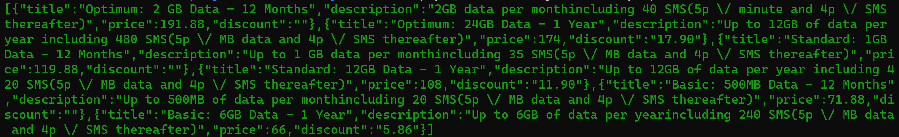
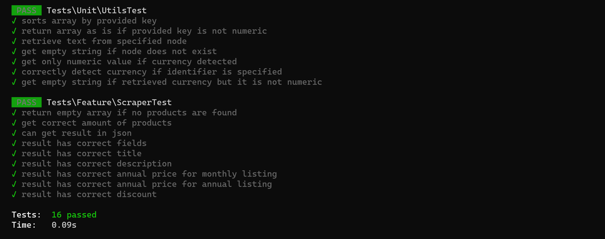

## Application Description

This is a simple scraper developed for a test. The task was:

Retrieve all packages for a given url and print them out in json format from a terminal.

The retrieved products should contain `title`, `description`, `price` and `discount`.

#### Assumptions made
- If any of the required fields do not exist, an empty string will be returned.
- The description is considered the text within the element with `package-description` class.
- Price is shown without the currency character.
- Price is shown per year, independently of whether the price was listed as monthly or annually.
- If the product does not contain the string `year` in its title, then it will be automatically assumed to be paid monthly
    and its price calculated accordingly.
- Discount field will only show the numerical value (without the remaining string text) and without the currency character. 
- If no products are found, an empty json result will be returned.

#### Files of interest for this exercise
For ease of access here is the list of files that was created by myself and not related to the existing framework.
- [config/scraper.php](config/scraper.php)
- [app/Helpers/Utils.php](app/Helpers/Utils.php)
- [app/Scrapers/DnsSystemsScraper.php](app/Scrapers/DnsSystemsScraper.php)
- [app/Console/Commands/DnsScrapeProductsCommand.php](app/Console/Commands/DnsScrapeProductsCommand.php)
- [tests/Unit/UtilsTest.php](tests/Unit/UtilsTest.php)
- [tests/Feature/ScraperTest.php](tests/Feature/ScraperTest.php)

## Requirements
- **[PHP 8.1](https://www.php.net/) and above.**
- **[Composer](https://getcomposer.org/) package manager.**

## Installation

After cloning the git repository, navigate into the newly created folder and run:

```
composer install
```

## Usage

```
php artisan dns-systems:scrape-products
```

The above will return a json representation of all the packages found ordered by highest price first.



## Run tests
```
php artisan test
```
Alternatively you can run:
```
./vendor/bin/phpunit
```


## Composer Dependencies

- **[Laravel framework](https://laravel.com). Version 9.**
- **[Goutte](https://github.com/dweidner/laravel-goutte). A thin wrapper for Laravel that uses [Symfony DomCrawler](https://symfony.com/doc/current/components/dom_crawler.html).**
